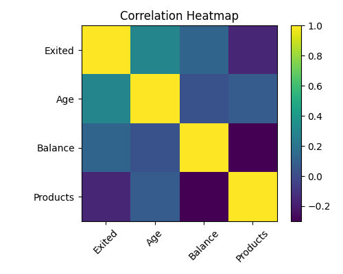
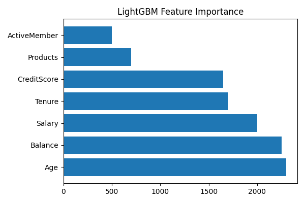
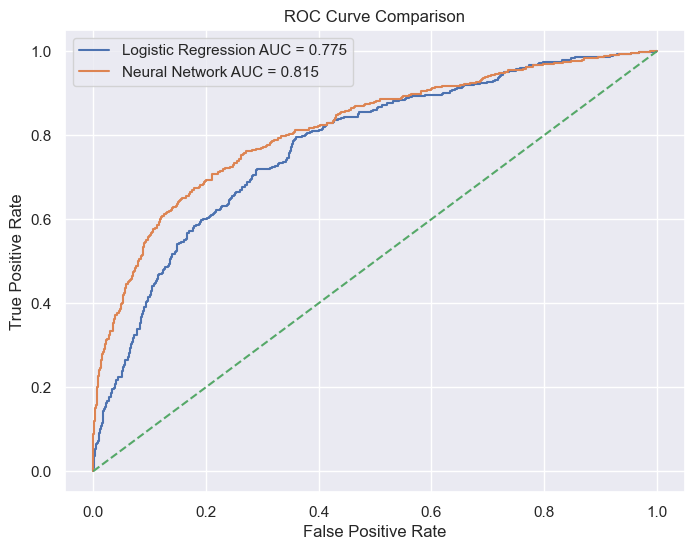
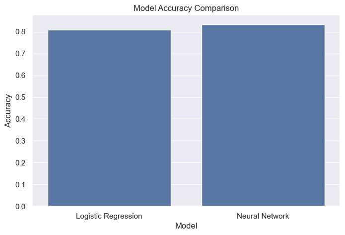

# Customer Churn Prediction using Logistic Regression and Neural Networks

Predicting customer churn is one of the most important business applications of machine learning. Customer churn occurs when customers discontinue using a company's products or services. Identifying such customers in advance allows businesses to take preventive actions and improve customer retention.

This project implements a complete machine learning workflow for customer churn prediction using both traditional machine learning and neural network approaches. The project covers data preprocessing, exploratory data analysis, feature engineering, model development, evaluation, visualization, and performance comparison.

---

## Project Overview

Customer retention is often more cost-effective than customer acquisition. Organizations can significantly reduce revenue loss by predicting churn behavior and taking proactive retention measures.

This project compares two classification models:

- Logistic Regression
- Artificial Neural Network (MLP Classifier)

The complete workflow includes:

- Data Cleaning
- Exploratory Data Analysis
- Correlation Analysis
- Feature Engineering
- Model Training
- Performance Evaluation
- ROC Curve Analysis
- Feature Importance Analysis
- Model Comparison

---

## Dataset Description

The project uses the Customer Churn Modelling Dataset containing customer demographic and banking information.

### Features

| Feature | Description |
|----------|-------------|
| CreditScore | Customer credit score |
| Geography | Customer country |
| Gender | Customer gender |
| Age | Customer age |
| Tenure | Number of years with the bank |
| Balance | Customer account balance |
| NumOfProducts | Number of products used |
| HasCrCard | Credit card ownership |
| IsActiveMember | Activity status |
| EstimatedSalary | Estimated annual salary |
| Exited | Churn Indicator (Target Variable) |

### Target Variable

| Value | Meaning |
|---------|----------|
| 0 | Customer Retained |
| 1 | Customer Churned |

---

## Technologies Used

| Category | Technology |
|-----------|-----------|
| Programming Language | Python |
| Development Environment | Jupyter Notebook |
| Data Processing | Pandas, NumPy |
| Data Visualization | Matplotlib, Seaborn |
| Machine Learning | Scikit-Learn |
| Classification Models | Logistic Regression, MLPClassifier |
| Version Control | Git, GitHub |

---

## Project Workflow

1. Dataset Loading
2. Data Inspection
3. Missing Value Verification
4. Exploratory Data Analysis
5. Correlation Analysis
6. Data Cleaning
7. Label Encoding
8. One-Hot Encoding
9. Feature Scaling
10. Train-Test Split
11. Logistic Regression Training
12. Neural Network Training
13. Model Evaluation
14. ROC Curve Analysis
15. Feature Importance Analysis
16. Model Comparison
17. Result Interpretation

---

## Repository Structure

```text
CUSTOMER-CHURN-PREDICTION/
│
├── Dataset/
│   └── Churn_Modelling.csv
│
├── images/
│   ├── heatmap.png
│   ├── feature_importance.png
│   ├── roc_curve.png
│   └── model_comparison.png
│
├── notebooks/
│   ├── Customer_Churn_Prediction.ipynb
│   └── .ipynb_checkpoints/
│
├── README.md
├── requirements.txt
├── steps.md
└── .gitattributes
```

---

## Visualizations

### Correlation Heatmap

The correlation heatmap illustrates relationships among numerical features and helps identify variables that influence customer churn.

<p align="center">
  
</p>

---

### Feature Importance Analysis

Feature importance analysis highlights the customer attributes that contribute most strongly to churn prediction.

<p align="center">
  
</p>

---

### ROC Curve Comparison

The ROC Curve compares the classification capability of Logistic Regression and Neural Network models.

<p align="center">
  
</p>

---

### Model Accuracy Comparison

The following visualization compares prediction accuracy achieved by both models.

<p align="center">
  
</p>

---

## Models Implemented

### Logistic Regression

Logistic Regression is a linear classification algorithm commonly used for binary classification problems.

Advantages:

- Fast training
- Easy interpretation
- Efficient computation
- Strong baseline model

Limitations:

- Assumes linear relationships
- Limited capability for complex patterns

---

### Artificial Neural Network (MLP Classifier)

A Multi-Layer Perceptron (MLP) neural network was implemented to learn nonlinear relationships among customer features.

Architecture:

```python
hidden_layer_sizes=(64,32)
activation='relu'
solver='adam'
max_iter=500
```

Advantages:

- Learns nonlinear patterns
- Handles complex feature interactions
- Improved predictive capability

Limitations:

- Higher computational cost
- Less interpretable than linear models

---

## Evaluation Metrics

The following metrics were used:

- Accuracy
- Precision
- Recall
- F1 Score
- Confusion Matrix
- ROC Curve
- AUC Score

These metrics provide a comprehensive assessment of model performance.

---

## Key Learning Outcomes

This project demonstrates:

- End-to-end machine learning workflow
- Customer churn prediction techniques
- Data preprocessing methods
- Exploratory data analysis
- Classification modeling
- Neural network implementation
- Model comparison techniques
- Business-oriented data interpretation

---

## Future Improvements

Potential future enhancements include:

- Hyperparameter Optimization
- Cross Validation
- Class Imbalance Handling using SMOTE
- Random Forest Classifier
- XGBoost Classifier
- LightGBM Classifier
- TensorFlow/Keras Deep Learning Models
- Flask Deployment
- FastAPI Deployment
- Streamlit Dashboard Integration

---

## Installation

Clone the repository:

```bash
git clone https://github.com/Bitttu4/Customer-Churn-Prediction.git
```

Move into project directory:

```bash
cd Customer-Churn-Prediction
```

Install required dependencies:

```bash
pip install -r requirements.txt
```

Launch Jupyter Notebook:

```bash
jupyter notebook
```

Open:

```text
notebooks/Customer_Churn_Prediction.ipynb
```

Run all notebook cells sequentially.

---

## Author

Aarya Patel

B.Tech Information Technology

Machine Learning Project

---

## License

This project is intended for educational and learning purposes.